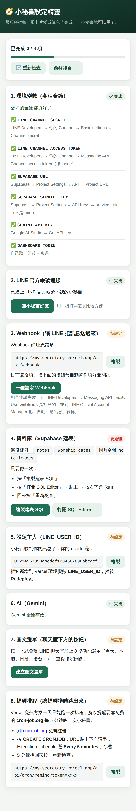
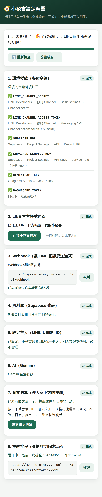

# 📋 EmmArk 小秘書

住在 LINE 裡的私人小秘書。直接打字就會幫你分類成待辦、提醒、筆記，到點準時提醒你；傳海報照片會自動建提醒，傳服事表 PDF 會自動排好整季服事。

**Fork 一份、填幾把金鑰，就是你自己的小秘書。** 全部用免費方案，不需要會寫程式，大約 30–40 分鐘可以完成。

> 🤖 **不想自己看教學？** 把這個 repo 交給 AI 助理（ChatGPT、Claude…），貼上 [`AI_SETUP.md`](AI_SETUP.md) 裡的提示詞，它會一步一步帶你完成。

---

## 目錄

1. [你需要準備什麼](#1-你需要準備什麼)
2. [建立 LINE 官方帳號（小秘書的本體）](#2-建立-line-官方帳號小秘書的本體)
3. [建立 Supabase 資料庫（小秘書的記憶）](#3-建立-supabase-資料庫小秘書的記憶)
4. [申請 Gemini API key（小秘書的大腦）](#4-申請-gemini-api-key小秘書的大腦)
5. [部署到 Vercel](#5-部署到-vercel)
6. [打開設定精靈，把每一項變綠色](#6-打開設定精靈把每一項變綠色)
7. [設定主人（只有你能用）](#7-設定主人只有你能用)
8. [讓提醒準時跳出來（cron-job.org）](#8-讓提醒準時跳出來cron-joborg)
9. [開始使用](#9-開始使用)
10. [常見問題](#10-常見問題)

---

## 1. 你需要準備什麼

| 帳號 | 用途 | 費用 |
|---|---|---|
| LINE 帳號 | 建立小秘書的 LINE 官方帳號 | 免費 |
| GitHub 帳號 | 存放你那一份程式碼（[註冊](https://github.com/signup)） | 免費 |
| Google 帳號 | 申請 AI（Gemini）金鑰 | 免費額度 |

Vercel、Supabase、cron-job.org 都可以直接用 GitHub 帳號登入，不用另外記密碼。

> 💡 **邊做邊記**：接下來會拿到好幾組金鑰。建議先開一個記事本，每拿到一組就貼上去，第 5 步部署時會一次用到。
>
> ```
> LINE_CHANNEL_SECRET=
> LINE_CHANNEL_ACCESS_TOKEN=
> SUPABASE_URL=
> SUPABASE_SERVICE_KEY=
> GEMINI_API_KEY=
> DASHBOARD_TOKEN=（自己取一組後台密碼，例如 my-secret-2026）
> ```

---

## 2. 建立 LINE 官方帳號（小秘書的本體）

### 2-1 建立官方帳號

1. 打開 [LINE 官方帳號建立頁](https://entry.line.biz/start/tw/)，按 **建立 LINE 官方帳號**，用你的 LINE 帳號登入。
2. 填寫帳號名稱（例如「我的小秘書」，之後可以改）、類別隨便選一個相近的，送出。
3. 建立完成後，進入 **LINE Official Account Manager**（管理後台）。

<!-- 截圖：LINE 官方帳號建立完成畫面 → docs/images/line-01-created.png -->

### 2-2 開啟 Messaging API

1. 在 LINE Official Account Manager 右上角按 **設定**。
2. 左側選 **Messaging API** → 按 **啟用 Messaging API**。
3. 第一次會要你建立「服務提供者（Provider）」：填你的名字即可。
4. 隱私權政策、服務條款網址可以留空，按確定。

<!-- 截圖：設定 → Messaging API → 啟用 → docs/images/line-02-enable-api.png -->

### 2-3 關掉自動回應（很重要）

不關的話，你傳什麼 LINE 都會先回一句罐頭訊息，小秘書的回覆會被蓋掉。

1. LINE Official Account Manager 左側選 **回應設定**。
2. **聊天** → 關閉。
3. **Webhook** → 開啟。
4. **自動回應訊息** → 關閉。

<!-- 截圖：回應設定頁 → docs/images/line-03-response.png -->

### 2-4 拿兩把金鑰

1. 打開 [LINE Developers](https://developers.line.biz/console/)，用同一個 LINE 帳號登入。
2. 點你剛剛建立的 Provider → 點你的官方帳號（Channel）。
3. **Basic settings** 分頁往下捲，找到 **Channel secret** → 複製，這就是 `LINE_CHANNEL_SECRET`。
4. 切到 **Messaging API** 分頁，捲到最下面 **Channel access token (long-lived)** → 按 **Issue** → 複製，這就是 `LINE_CHANNEL_ACCESS_TOKEN`。

<!-- 截圖：Basic settings 的 Channel secret → docs/images/line-04-secret.png -->
<!-- 截圖：Messaging API 的 Channel access token → docs/images/line-05-token.png -->

> Webhook URL 先不用填，第 6 步設定精靈會一鍵幫你填好。

---

## 3. 建立 Supabase 資料庫（小秘書的記憶）

### 3-1 建立專案

1. 打開 [Supabase](https://supabase.com/dashboard)，用 GitHub 登入。
2. 按 **New project**。
3. **Name**：隨便取（例如 `line-secretary`）。
4. **Database Password**：按 Generate 產生一組就好（之後用不到，但請記下來）。
5. **Region**：選 **Northeast Asia (Tokyo)** 或 **Southeast Asia (Singapore)**，離台灣近比較快。
6. 按 **Create new project**，等 1–2 分鐘建立完成。

<!-- 截圖：New project 表單 → docs/images/supabase-01-new.png -->

### 3-2 建立資料表

1. 左側選 **SQL Editor** → **New query**。
2. 打開本專案的 [`supabase/schema.sql`](supabase/schema.sql)，全選複製，貼進去。
3. 按右下角 **Run**，看到 `Success. No rows returned` 就完成了。

> 忘記做也沒關係：第 6 步設定精靈會偵測到，並提供「複製建表 SQL」和「打開 SQL Editor」按鈕。

<!-- 截圖：SQL Editor 貼上後按 Run → docs/images/supabase-02-sql.png -->

### 3-3 拿兩把金鑰

1. 左側最下面 **Project Settings**（齒輪）→ **Data API**（或 API）。
2. **Project URL** → 複製，這就是 `SUPABASE_URL`（長得像 `https://abcdxyz.supabase.co`）。
3. 切到 **API Keys**，找到 **service_role**（標示 secret）→ 按 Reveal → 複製，這就是 `SUPABASE_SERVICE_KEY`。

> ⚠️ 一定要用 **service_role**，不是 anon / publishable。這把金鑰等於資料庫的萬用鑰匙，只能填在 Vercel，不要貼到任何公開的地方。

<!-- 截圖：API Keys 的 service_role → docs/images/supabase-03-keys.png -->

---

## 4. 申請 Gemini API key（小秘書的大腦）

1. 打開 [Google AI Studio](https://aistudio.google.com/apikey)，用 Google 帳號登入。
2. 按 **Create API key**（第一次可能要先同意條款）。
3. 複製那串金鑰，這就是 `GEMINI_API_KEY`。

<!-- 截圖：AI Studio 的 Create API key → docs/images/gemini-01-key.png -->

免費額度對一個人用很足夠；每天額度用完時小秘書會主動告訴你，隔天自動恢復。

---

## 5. 部署到 Vercel

有兩種方式，**建議用 A**：之後原作者推出新功能，你按一下就能更新。

| | A. Fork（建議） | B. 一鍵部署按鈕 |
|---|---|---|
| 難度 | 多 2 個步驟 | 最快 |
| 之後接收更新 | 按 **Sync fork** 就好 | 要另外開啟自動同步（見第 10 節） |
| 你的程式碼 | 公開（金鑰不在程式碼裡，放心） | 可以設成私有 |

### A. Fork（建議）

1. 在本頁右上角按 **Fork** → **Create fork**，你的 GitHub 就會有一份自己的副本。
2. 打開 [Vercel](https://vercel.com/new)，用 GitHub 登入，在 **Import Git Repository** 找到剛剛 fork 的 repo，按 **Import**。
3. 展開 **Environment Variables**，把記事本裡的 6 組金鑰一個一個加進去（Key 填左邊的名稱，Value 貼上值）。
4. 按 **Deploy**，等 1 分鐘左右看到煙火 🎉 就完成了。
5. 按 **Continue to Dashboard**，上方 **Domains** 那串網址（例如 `https://line-secretary-xxxx.vercel.app`）就是你的小秘書網址。

<!-- 截圖：GitHub Fork 按鈕 → docs/images/github-01-fork.png -->
<!-- 截圖：Vercel Import 並填環境變數 → docs/images/vercel-01-env.png -->
<!-- 截圖：部署成功畫面 → docs/images/vercel-02-done.png -->

### B. 一鍵部署按鈕

[](https://vercel.com/new/clone?repository-url=https%3A%2F%2Fgithub.com%2Fwindsjp00171-star%2Fline-secretary-&project-name=line-secretary&repository-name=line-secretary&env=LINE_CHANNEL_SECRET,LINE_CHANNEL_ACCESS_TOKEN,SUPABASE_URL,SUPABASE_SERVICE_KEY,GEMINI_API_KEY,DASHBOARD_TOKEN&envDescription=%E6%AF%8F%E4%B8%80%E6%8A%8A%E9%87%91%E9%91%B0%E5%8E%BB%E5%93%AA%E8%A3%A1%E6%8B%BF%EF%BC%8C%E8%A6%8B%20README%20%E7%AC%AC%202%E2%80%934%20%E6%AD%A5&envLink=https%3A%2F%2Fgithub.com%2Fwindsjp00171-star%2Fline-secretary-%23readme)

1. 用 GitHub 登入 Vercel。
2. **Create Git Repository**：Vercel 會在你的 GitHub 複製一份程式碼（名稱可以改，可以勾選 **Private**）。這份複本和原作者沒有連結，想接收更新請見第 10 節的「自動同步」。
3. **Configure Project**：畫面會列出 6 個環境變數，把記事本裡的值一個一個貼上。
4. 按 **Deploy**，等 1 分鐘左右看到煙火 🎉。
5. 按 **Continue to Dashboard**，上方 **Domains** 那串網址就是你的小秘書網址。

---

## 6. 打開設定精靈，把每一項變綠色

在瀏覽器打開 **你的網址 + `/setup.html`**，例如：

```
https://line-secretary-xxxx.vercel.app/setup.html
```

輸入你設定的 `DASHBOARD_TOKEN`，設定精靈會逐項檢查，並告訴你下一步：

<p align="center">
  
  &nbsp;&nbsp;
  
</p>

| 卡片 | 你要做的事 |
|---|---|
| 1. 環境變數 | 有缺的照說明補到 Vercel → Settings → Environment Variables，再 Redeploy |
| 2. LINE 連線 | 綠色就好。按「加小秘書好友」 |
| 3. Webhook | 按 **一鍵設定 Webhook** |
| 4. 資料庫 | 還沒建表的話：按「複製建表 SQL」→「打開 SQL Editor」→ 貼上 → Run |
| 5. 設定主人 | 見第 7 步 |
| 6. AI | 綠色就好 |
| 7. 圖文選單 | 按 **建立圖文選單**，聊天室下方就會出現 8 格按鈕 |
| 8. 提醒排程 | 見第 8 步 |

改完任何設定後按 **🔄 重新檢查**。

---

## 7. 設定主人（只有你能用）

小秘書是私人的：設定好主人之後，別人就算加了好友、傳訊息，它也不會理，更不會寫進你的資料庫。

1. 用手機加小秘書好友（設定精靈第 2 張卡有按鈕，或在 LINE 搜尋你的官方帳號 ID）。
2. 傳任何一句話，例如「你好」。
3. 小秘書會回你一串 `U` 開頭的 userId。設定精靈第 5 張卡也會出現，可以直接按「複製」。
4. 到 Vercel → 你的專案 → **Settings → Environment Variables** → 新增：
   - Key：`LINE_USER_ID`
   - Value：貼上那串 userId
5. 到 **Deployments** → 最上面那一筆右邊的 **⋯** → **Redeploy**。

<!-- 截圖：Vercel 新增環境變數 → docs/images/vercel-03-add-env.png -->
<!-- 截圖：Deployments → Redeploy → docs/images/vercel-04-redeploy.png -->

> 為什麼要 Redeploy？Vercel 的環境變數要重新部署後才會生效。之後只要改了環境變數，都要 Redeploy 一次。

---

## 8. 讓提醒準時跳出來（cron-job.org）

Vercel 免費方案的排程一天只能跑一次，所以「提醒」要靠免費的 cron-job.org，每 5 分鐘叫小秘書檢查一次有沒有要提醒的事。

1. （建議）先到 Vercel 新增環境變數 `CRON_SECRET`，值隨便取一組亂碼，然後 Redeploy。這樣別人不能亂打你的排程網址。
2. 到設定精靈第 8 張卡，按「複製」拿到排程網址。
3. 打開 [cron-job.org](https://console.cron-job.org/signup) 免費註冊並登入。
4. 按 **CREATE CRONJOB**：
   - **Title**：小秘書提醒
   - **URL**：貼上剛剛複製的網址
   - **Execution schedule**：選 **Every 5 minutes**
5. 按 **CREATE**。
6. 5 分鐘後回設定精靈按「重新檢查」，第 8 張卡變綠色就完成了。

<!-- 截圖：cron-job.org 建立排程 → docs/images/cron-01-create.png -->

每天早上的早安簡報和每週五的週報，Vercel 會自己排好，不用另外設定。

---

## 9. 開始使用

在 LINE 跟小秘書說話就好，不用背指令：

| 你打 | 小秘書會 |
|---|---|
| `明天下午三點開會` | 自動建一個提醒，到點前 5 分鐘通知你 |
| `每週三下午四點同工會` | 每週重複提醒 |
| `開會改到後天下午兩點` | 找出那一筆，給你確認卡片，按一下就改好 |
| `報告做完了`／`讀書會取消了` | 標記完成／刪除（都可以復原） |
| `明天有什麼事`／`還有哪些沒做完` | 直接回答你 |
| `買牛奶` | 記成待辦 |
| `今天` / `本週` | 列出今天／這週的事 |
| `待辦` | 列出所有未完成，每項可以直接按 ✅ |
| 傳一張活動海報 | 讀出時間地點，自動建提醒 |
| 傳一張收據 | 記一筆帳 |
| 傳服事表 PDF | 自動開好那一季、填好所有服事 |
| `服事表 10/4` | 那天的完整服事名單 |
| `指令` | 所有功能的按鈕選單 |

後台網址是 **你的網址**（例如 `https://line-secretary-xxxx.vercel.app`），也可以直接按圖文選單右下角的「後台」。

---

## 10. 常見問題

**傳訊息給小秘書沒有反應？**
依序檢查：設定精靈是不是 8 項都綠色 → LINE 回應設定的「自動回應訊息」有沒有關掉、「Webhook」有沒有開 → 有沒有設定 `LINE_USER_ID` 並 Redeploy。

**一直收到「感謝您的訊息…」之類的罐頭回覆？**
LINE Official Account Manager → 回應設定 → 關閉「自動回應訊息」。

**要花錢嗎？**
一個人使用的量，全部在免費額度內。唯一要注意的是 LINE：台灣的免費方案每月可以**主動推播** 200 則訊息（提醒、早安簡報、週報都算）；你傳訊息後小秘書的回覆不算。一般個人使用夠用，提醒很多的話可以到 LINE Official Account Manager 看用量。

**「AI 今天的免費額度用完了」？**
Gemini 每天有免費額度，用完後隔天自動恢復。這段期間用「待辦 內容」「提醒 內容」這類指令開頭，不需要 AI 也能記錄。

**原作者更新了功能，我要怎麼跟上？**
- **用 Fork 建立的**：到你 GitHub 上的那份 repo，按 **Sync fork** → **Update branch**，Vercel 會自動重新部署。
- **想完全自動**（Fork 或部署按鈕都適用）：到你 repo 的 **Actions** 分頁 → 按 **I understand my workflows, go ahead and enable them**。之後每週一凌晨會自動合併原作者的更新；想馬上更新，可以在 Actions 分頁點「同步原作者更新」→ **Run workflow**。
- 如果你自己改過程式，而且剛好跟原作者改到同一個地方，自動同步會失敗、GitHub 會寄信通知你，你的程式不會被動到。
- 更新說明裡如果寫「需要更新資料表」，請再到 Supabase SQL Editor 執行一次最新的 [`supabase/schema.sql`](supabase/schema.sql)（重複執行不會影響已有的資料）。

**我可以改名字、改頭像嗎？**
可以，到 LINE Official Account Manager → 設定 → 帳號設定。

---

## 給開發者

- 技術：Vercel Serverless（Node.js）＋ Supabase（Postgres）＋ Gemini ＋ LINE Messaging API
- 本機測試：`npm ci && npm test`
- 資料庫結構：[`supabase/schema.sql`](supabase/schema.sql)
- 所有環境變數說明：[`.env.example`](.env.example)
- 給 AI 助理的部署規格：[`AI_SETUP.md`](AI_SETUP.md)
- 更新紀錄：[`CHANGELOG.md`](CHANGELOG.md)

## 授權

[MIT](LICENSE)：可以自由使用、修改、分享，只要保留原作者的署名。
